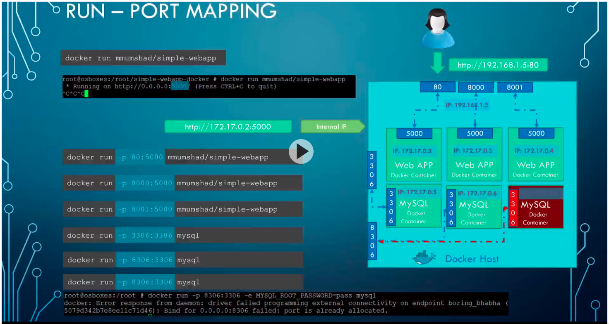

# Learning docker

  

## Installation

  

follow instructions on [this link](https://www.digitalocean.com/community/tutorials/how-to-install-and-use-docker-on-ubuntu-18-04)

  

---

  

## General learning commands

  

---

  

- `cat /etc/*release*` checks current os info.

- `docker ps` => Show the running docker images on my pc.

- `docker ps -a` => Show the running/not-running docker images on my pc.

- `docker run x` download x image if it's not available offline.

- `docker stop x` stop x image and prints its name 'x' if successful.

- `docker rm x` remove x image from device and prints 'x' if successful.

- `docker images` shows images that are offline

- `docker rmi x` removes 'x' image must have no dependent containers on it.

- `docker pull x` pull x image only, but don't mount it.

- `docker run ubuntu sleep 1000` run ubuntu image and let it sleep for 1000s.

- `docker exec quirky_franklin cat /etc/hosts` execute a command on a running container.

- `docker run ubuntu:17.04` run ubuntu image with version `17.04`

- `docker run mmumshad/simple-webapp` run image in attached mode in terminal.

- `docker run -d mmumshad/simple-webapp` run image in de-attached mode.

- `docker attach ${name_of_instance_or_id}` attach image to current terminal.

- `docker run -i ${name_of_instance_or_id}` make x image listen on STDIN of my pc.

- `docker run -p 80:5000 ${name_of_instance_or_id}` map port **80 of host** to serve port **5000 on docker** container for more info [check port mapping in images section](#Images).

- `docker build .` build the current image in this directory

- `docker run -it ${name_of_instance_or_id}` => get in docker image terminal

- `docker run -v /home/galala/Projects/learning_docker:/mnt -it a2a15febcdf3`  **mount** the learning_docker folder into /mnt in docker image (mount means that the folder will be synced between docker image and system folder)

  

## Notes

  

- Every docker container have its ip but its private by host of the container.

  

## Images

  

- Port mapping

